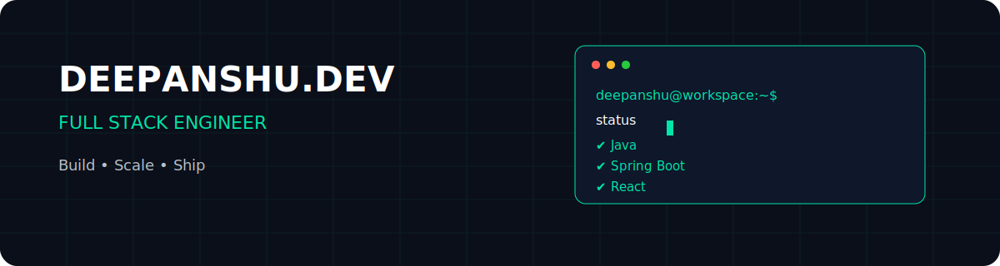

<!-- ========================================================== -->
<!--                     HERO SECTION                           -->
<!-- ========================================================== -->

<div align="center">



<br>


<br>

<a href="https://github.com/deepanshu-mandy">

</a>

<a href="https://www.linkedin.com/in/deepanshu-mandhyan/">

</a>


</div>

---

## ```console

$ boot developer-session

> Authenticating...

> Loading workspace...

> Loading projects...

> Initializing Java Runtime...

> Starting Spring Boot Environment...

✔ Developer session started successfully.

```

---

## developer.yml

```yaml
name: Deepanshu Mandhyan

role: Full Stack Developer

education:
  - B.E. Computer Science Engineering

backend:
  - Java
  - Spring Boot
  - REST APIs

frontend:
  - React
  - JavaScript
  - HTML
  - CSS

database:
  - MySQL
  - PostgreSQL

currently_learning:
  - Docker
  - AWS
  - Distributed Systems
  - Microservices

philosophy:
  Build software that people can trust.
```

---
